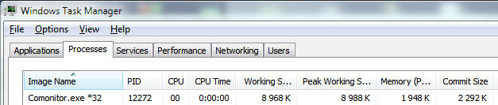

# Comonitor

Small tool for monitoring new COM-port devices. For Windows Vista/7/10/11.

If you use many different USB-UART adapters, flashers, virtual COM-port devices, arduinos, etc, it is hard to remember their numbers. COM numbers could change after connecting device to different USB-port. Looking into Device Manager every time you connected new device is annoying. So I wrote this little tool. It runs in system tray and show you a message each time you connect a COM-port device.

Also you can view a list of all connected communication port devices.

Written in C++ without any frameworks, so it is very small

And use a little of memory

### Installation

Download [compiled exe](build-Release/release/Comonitor.exe) and put it in Startup folder (Start > All Programs, then right-click on Startup and selecting "Open"). Or just run from any folder of desktop as needed.

### Authors

* **ACE** - [e-mail](mailto:ace@imlazy.ru)
